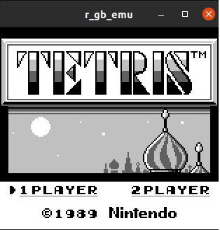
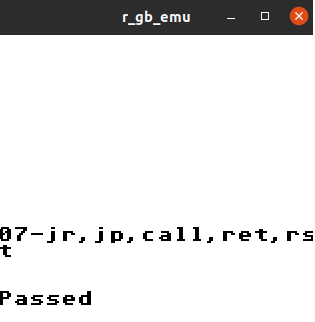
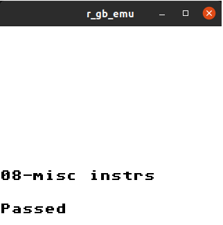

# r_gb_emu

[](https://rust-lang.org/)


A Gameboy emulator written in Rust 🎮

## Screens

### Games

| Game Name    | Result                              |
|--------------|-------------------------------------|
| Tetris       |       |


### Tests

| Test Name       | Result                              |
|-----------------|-------------------------------------|
| cpu_instrs_07   |      |
| cpu_instrs_08   |      |

## Gameplay Keys

| Keyboard Key       | Emulator Key       |
| ------------------ | ------------------ |
| Up/Down/Left/Right | Up/Down/Left/Right |
| Z                  | A                  |
| X                  | B                  |
| Space              | Select             |
| Enter              | Start              |


## Knowledge

60fps code
```cpp

while(1) {
    deltaTime = CurrentTime()-OldTime;
    oldTime = CurrentTime();
    accumulator += deltaTime;
    while(accumulator > 1.0/60.0){
        update();
        accumulator -= 1.0/60.0;
    }
    render();
    display();
}
```

----------------------------------------------------------------------------------------------
## Useful Links
### Documentation
- [A journey into Gameboy Emulation Blog](https://robertovaccari.com/blog/2020_09_26_gameboy/)
- [Codeslinger](http://www.codeslinger.co.uk/pages/projects/gameboy/lcd.html)
- [EmuDev](https://emudev.de/gameboy-emulator/%e2%af%88-ppu-rgb-arrays-and-sdl/)
- [Pandocs](https://gbdev.io/pandocs/CPU_Instruction_Set.html#8-bit-load-instructions)
- [DMG-01: How to Emulate a Game Boy](https://rylev.github.io/DMG-01/public/book/introduction.html)
- [8080 Programmers Manual](https://altairclone.com/downloads/manuals/8080%20Programmers%20Manual.pdf)

- [Everything You Always Wanted To Know About GAMEBOY](https://www.devrs.com/gb/files/gbspec.txt)
- [Study of the techniques for emulation 
programming](http://www.codeslinger.co.uk/files/emu.pdf)

- [Nes emulator](https://bugzmanov.github.io/nes_ebook/chapter_2.html)
- [Half carry flag](https://gist.github.com/meganesu/9e228b6b587decc783aa9be34ae27841)

### Repository
- [rboy](https://github.com/mvdnes/rboy/tree/master)
- [rustyboy](https://github.com/daveallie/rustyboy)
- [mohanson](https://github.com/mohanson/gameboy)

### Libraries
- [minifb](https://crates.io/crates/minifb)


### Debugging
- [Gameboy doctor](https://github.com/robert/gameboy-doctor?tab=readme-ov-file)
- [bgb emulator](https://bgb.bircd.org/)
- [blargg-gb-tests](https://gbdev.gg8.se/files/roms/blargg-gb-tests/)

Once you have your logfile (by running `07-jr,jp,call,ret,rst.gb`), feed it into Gameboy Doctor like so:

```bash
./gameboy-doctor cpu_log.log  cpu_instrs 7
```